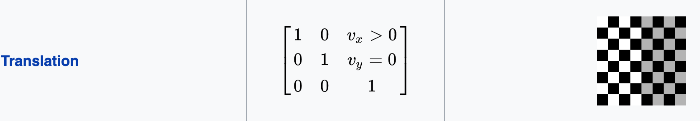
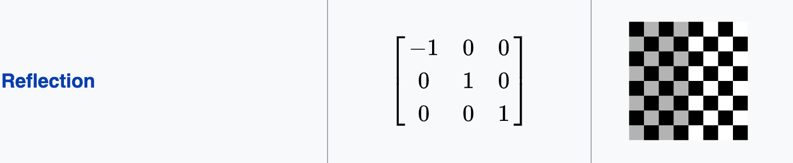
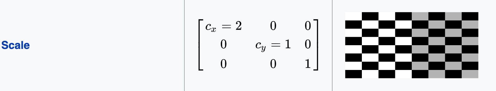
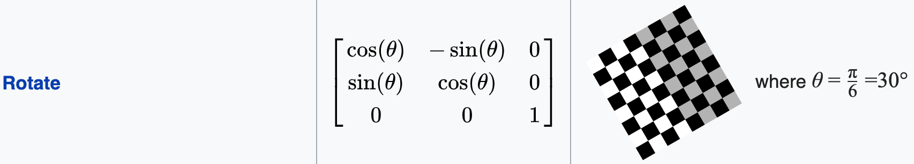
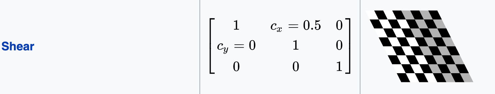
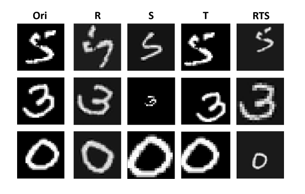

# Group Equivariance Convolution Nerual Network

In my class presentation I talked about Cohen and Bekkers work on GCNN. In this demo code we try to achive equivaraince by group transformation which are not limited to discrete transformation groups(Colen 2016) and rotaion and translation goups (Bekkers 2018). The advantages of this system is

1. Can be used for continous groups transformation.
2. Avoid data argumenation which eats up network complexity.
3. Garaunties equivarance that is input after group tansformation are mapped to the same output result.
4. Other transformation can be implemented easily in this network.

This code work is extended work of Equivariant tranformer network by Kai Sheng Tai. More details can be found in our ICML 2019 paper: https://arxiv.org/abs/1901.11399.

## Motivation

Consider, for example, the problem of classifying street signs in real-world images. In this domain, we know that the appearance of a sign in an image is subject to various deformations: the sign may be rotated, its scale will depend on its distance, and it may appear distorted due to perspective in 3D space. Regardless, the identity of the street sign should remain invariant to these transformations.

## Transformation considers for this demo

Transformation considered are affine tranformations

<p align="center">
  
</p>

<p align="center">
  
</p>

<p align="center">
  
</p>

<p align="center">
  
</p>

<p align="center">
  
</p>

## Datasets

Dataset I have used for this is MNIST. Which is data of hand written digits. I have transformed images in this dataset to be used for my demo.

<p align="center">
  
</p>

Dataset is availabe at: http://yann.lecun.com/exdb/mnist/

## Network Architectures

1. Used a CNN architecture based on the Z2CNN from Cohen & Welling (2016), with 7 layers of 3×3 convolutions with 32 channels, batch normalization after convolutional layers, and dropout after the 3rd and 6th layers. 
2. Heuristic approach of using a sequence of tranformation layers, each of which aims to remove the effect of its corresponding subgroup of the full transformation group.
3. Each tranformer layer predicts a pose parameter whose inverse transformation is applied to the input image.
4. The pose predictor networks are 3-layer CNNs with 32 channels in each layer. We selected the transformation order, dropout rate, and learning rate schedule based on validation accuracy.

## Instruction to run the code

1. System requirements:
```sh
python >=3.6
pytorch >=1.0 (https://pytorch.org/get-started/locally/)
fire (pip install fire / conda install fire -c conda-forge)
Colab
```
2. To download and create the dataset run the following command:
```sh
$ python datasets.py projective_mnist --data_dir=<PATH>
```
3. I have already provided pre-train model inside my code directory as model.pt for Transformers: Translation -> Rotation -> Scale -> ReflectionX -> ShearX. For training a model with other transformation group run the following command 

```sh
$ python experiment_mnist.py train --train_path <PATH>/train.pt--valid_path <PATH>/valid.pt --save_path <SAVE_PATH> --tfs "[<TRANSFROMATION>]"
```
In –tfs flag you have to provide the transformation you want to have in your model. The transformations implemented are in list below, copy paste the exact names in this flag comma separated.
a. Translation
b. Rotation
c. Scale
d. ShearX
e. ShearY
f. ReflectionX
g. ReflectionY
h. FunnyMirrorDistortion

4. To evaluate a saved model on the test set run:
```sh
python experiment_mnist.py --load_path <SAVE_PATH> test --test_path<PATH>/valid.pt
```
•GroupEquiDemo.ipynb is the Colab notebook for the demo run. You can simply open it in Google Colab and start run all, it will automatically run everything. I have made it fully automated by !git download to load models and !python to generated dataset. Hope you enjoy playing around with this.

## Results

Various networks which different transformation goup Vs Accuarcy

| Tranformations  | Accuracy  |
| ---| ---|
| Translation, Rotation  | 83.68%  |
| Translation, Rotation, Scale  | 86.27% |`
| Translation, Rotation, Scale, Sheer |  85.68% |
| Translation, Rotation, Scale, Sheer, reflection | 71% |
| Translation, Rotation, Scale, Sheer, reflection, funny distortion | 42%  | 

## Conclusion and future directions

1. Stacking tranformation layers is ultimately a heuristic approach as it does not guarantee equivariance with respect to the full transformation group.
2. Higher-dimensional groups require the use of long sequences of tranformation layers, resulting in high computational cost. 
3. In such cases, we could employ a hybrid approach where “difficult” subgroups are handled by tranformation layers, while the remaining degrees of freedom are handled by G-CNNs as suggested by Bekkers (2018).
4. In general, enforcing equivariance guarantees for higher-dimensional transformation groups in a computationally scalable fashion remains an open problem.

